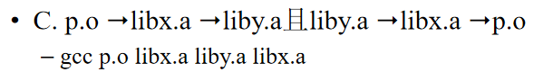
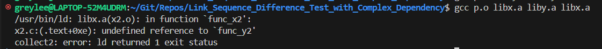
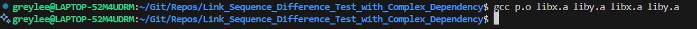

# Link Sequence Difference Test with Complex Dependency
本实验以寻找具有复杂依赖关系的静态库的正确链接方法为目标，实现了简单的对于不同链接指令的差分测试

## 疑问
在练习题7.3中，C题题设给出了一个复杂的依赖条件如下

</img>

但是对于函数的复杂嵌套，如图简单的指令似乎并不能实现目标。

## 实验目标
证明图示指令无法覆盖所有情况，并尝试给出正解

## 前备知识
符号解析阶段，链接器从左到右按照它们在编译器驱动程序命令行上出现的顺序来扫描可重定位目标文件和存档文件，扫描中，链接器维护三个集合：
- 可重定位目标文件集合E：集合中的文件会被合并起来形成可执行文件
- 未解析符号集合U：引用了但是尚未定义的符号
- 符号集合D：在前面输入文件中已定义的符号集合
- 初始时，E、U、D均为空
解析过程：
- 命令行上的每个输入文件f，链接器判断f是一个目标文件还是一个存档文件
  - 如果f是一个目标文件，链接器把f添加到E，修改U和D来反映f中的符号定义和引用，并继续下一个输入文件
  - 如果f是一个存档文件，链接器尝试匹配U中未解析的符号和由存档文件成员定义的符号
    - 如果某个存档文件成员m定义了一个符号来解析U中的一个引用，则将m加到E中，并且链接器修改U和D来反映m中的符号定义和引用
    - 对存档文件中所有的成员目标文件都进行这个过程，直到U和D不再发生变化 
    - 任何不包含在E中的成员目标文件都被简单地抛弃，链接器继续处理下一个输入文件
- 如果链接器完成对命令行上输入文件的扫描后，U是非空的，则链接器输出一个错误并终止；否则会合并和重定位E中的目标文件，构建输出的可执行文件


## 实验假设
- `p.o` 依赖于 `x1.o`（在 `libx.a` 中）。
- `x1.o` 依赖于 `y1.o`（在 `liby.a` 中）。
- `y1.o` 依赖于 `x2.o`（在 `libx.a` 中）。
- `x2.o` 依赖于 `y2.o`（在 `liby.a` 中）。

p.c代码：

```c
// p.c
int func_x1();
int main()
{
    return func_x1();
}
```

x1.c代码：

```c
// x1.c
int func_y1();
int func_x1()
{
    return func_y1() & 1;
}
```

y1.c代码：
```c
// y1.c
int func_x2();
int func_y1()
{
    return func_x2() + 1;
}
```

x2.c代码：
```c
// x2.c
int func_y2();
int func_x2()
{
    return func_y2() * 3;
}
```

y2.c代码：
```c
// y2.c
int func_y2()
{
    return 1 + 1;
}
```

以上假设满足图示要求

## 预期效果
### 命令：`gcc p.o libx.a liby.a libx.a`
1. **扫描 `p.o`：**
   - 链接器首先解析 `p.o`，将func_x1放入U中，p.o放入E中。
   - 链接器将继续向下查找这些符号。

2. **扫描 `libx.a`：**
   - 链接器扫描 `libx.a`，根据U中的func_x1找到 `x1.o`。
   - 解析 `x1.o` 后，将func_x1从U转移到D中，将func_y1放入U中，将x1.o放入E中。
   - **注意此次扫描并未将x2.o放入E中，func_x2也没有进入D中。**

3. **扫描 `liby.a`：**
   - 链接器扫描 `liby.a`，根据U中的func_y1找到 `y1.o`。
   - 解析 `y1.o` 后，将func_y1从U转移到D中，将func_x2放入U中，将y1.o放入E中。
   - **注意此次扫描并未将y2.o放入E中，func_y2也没有进入D中。**

4. **扫描 `libx.a` 中的 `x2.o`：**
   - 链接器扫描 `libx.a`，根据U中的func_x2找到 `x2.o`。
   - 解析 `x2.o` 后，将func_x2从U转移到D中，将func_y2放入U中，将x2.o放入E中。

到此链接器完成扫描，而U中含有func_y2，非空。
因此，`gcc p.o libx.a liby.a libx.a` 会导致链接失败。

## 改进方法
### 命令：`gcc p.o libx.a liby.a libx.a liby.a`
1. **扫描 `p.o`：**
2. **扫描 `libx.a`：**
3. **扫描 `liby.a`：**
4. **扫描 `libx.a` 中的 `x2.o`：**
   *以上四步与上一个命令相同*
1. **扫描 `liby.a` 中的 `y2.o`：**
   - 链接器扫描 `liby.a`，根据U中的func_y2找到 `y2.o`。
   - 解析 `y2.o` 后，将func_y2从U转移到D中，将y2.o放入E中。
  
到此链接器完成扫描，U为空。
链接成功。

## 实验验证
### 命令：`gcc p.o libx.a liby.a libx.a`
</img>

### 命令：`gcc p.o libx.a liby.a libx.a liby.a`
</img>

假设成立

## 总结与反思
对于函数的复杂嵌套与静态库的复杂依赖关系，使用简单的指令无法保证链接一定成功（仅针对需链接静态库的情况）。本实验提出的改进方案也无法保证一定链接成功，比如若y2中又使用了x3，x3又使用了y3…… 因此对于涉及静态库的链接，或许有其他更好的方法。

## 源码地址
<a href="https://github.com/GreyLee-Hacker/Link_Sequence_Difference_Test_with_Complex_Dependency">点击访问GitHub仓库</a>